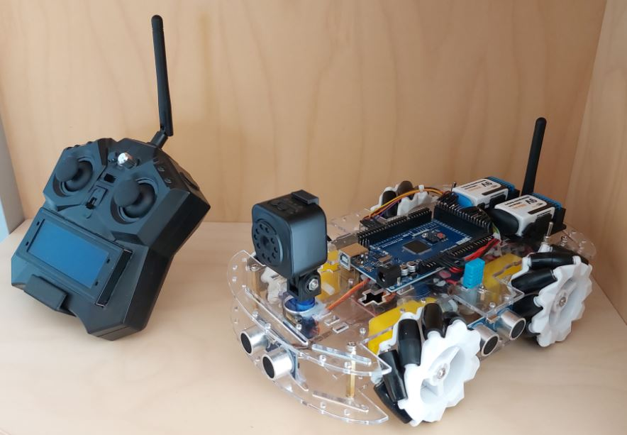

# Mechanum-Wheel-Car
    
Make sure you check out the other [images](./images) as well
## Libraries
Here you can see which libraries were used to program the two components of this project:

### Mechanum Wheel Car
 - [dht11](https://github.com/adidax/dht11)    
 - [Mirf](https://github.com/WayinTop/Wireless-Communication-System)    
 - [NewPing](https://bitbucket.org/teckel12/arduino-new-ping/src/master/src/NewPing.cpp)    
 - [Servo](https://github.com/arduino-libraries/Servo/blob/master/src/avr/Servo.cpp)    

### Remote Control
 - [LiquidCrystalI2C](https://github.com/johnrickman/LiquidCrystal_I2C)    
 - [Mirf](https://github.com/WayinTop/Wireless-Communication-System)    
